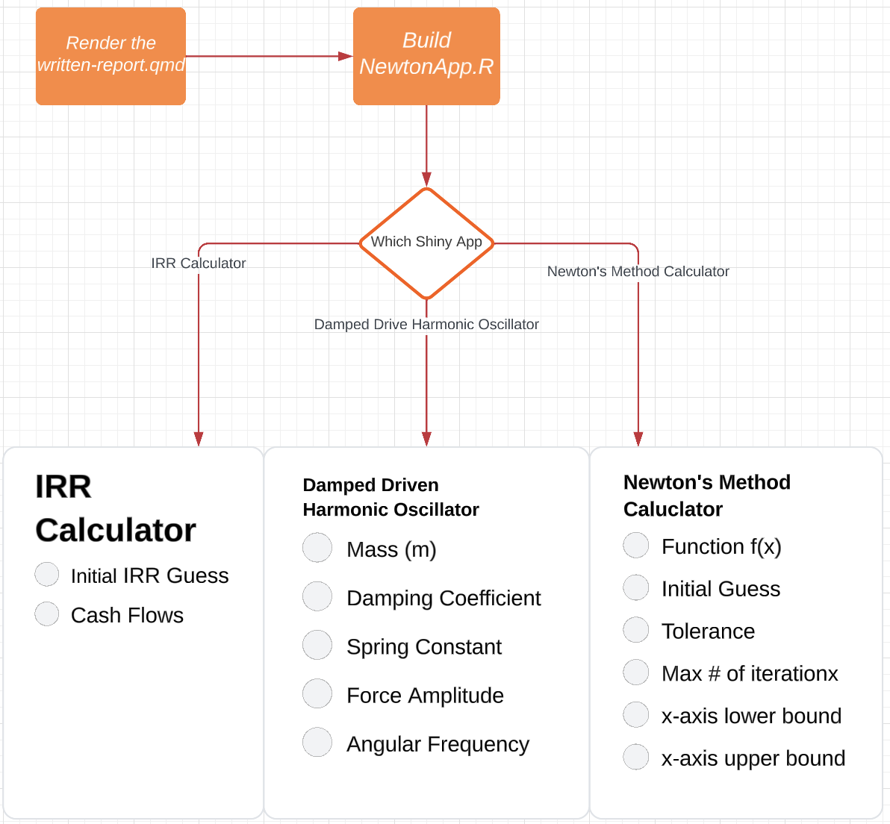

# STA 323 Final Project

#### Team 1: Abdel Shehata, Matthew Paul, Alan Wang

## Introduction and File Descriptions 

The goal of this project is to create an interactive shiny app dashboard to 
demonstrate Newton’s method for approximating roots and how Newton's Method is 
applied in various fields. You can run the `NewtonApp.r` to view the shiny app 
dashboard with three distinct applications for Newton's Method. 

Additionally, you may render our written report (`written-report.qmd`) to read 
about the different shiny apps and how each uses Newton’s Method. Our 
presentation can be accessed in the `presentation.pdf` file.

The `references.bib` file contains the references that are cited in the written 
report. The `other` folder contains an image that is used in the README that 
describes the layout of the repository.

## Repository Flow Overview



## How to Run the Dashboard

Open the terminal tab in your R console and run the following lines in order
one by one: 

```
git clone git@github.com:sta323-sp23/project-team01.git
cd project-team01
R
install.packages(c("shiny", "shinydashboard", "tidyverse", "Deriv", "ggplot2"))
library(shiny)
library(shinydashboard)
runApp(“NewtonApp.R”)
```

After this step the dashboard should be running on your browser. You can use 
the menu on the left side of the page to select and use any of the shiny apps we 
built.

